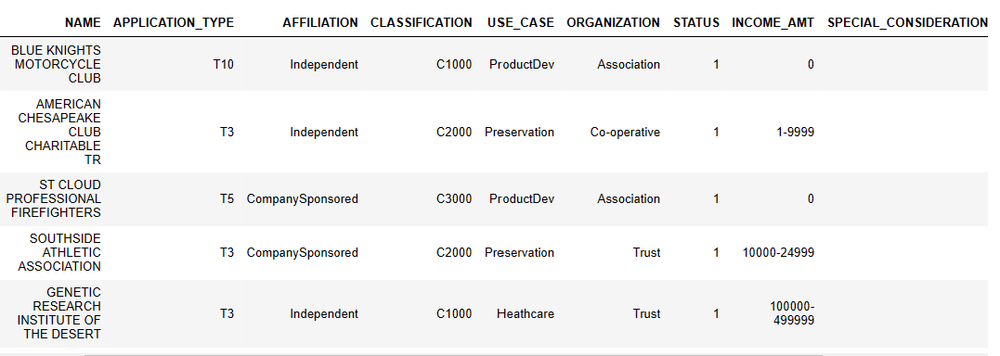
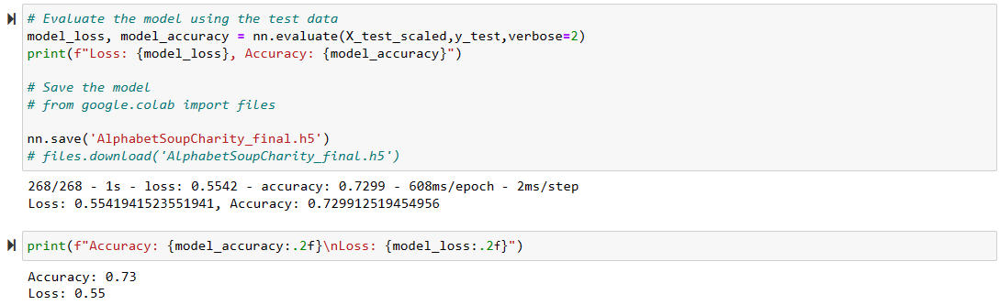

# deep-learning-challenge

## Background

The nonprofit foundation Alphabet Soup wants a tool that can help it select the applicants for funding with the best chance of success in their ventures. With your knowledge of machine learning and neural networks, you’ll use the features in the provided dataset to create a binary classifier that can predict whether applicants will be successful if funded by Alphabet Soup.

From Alphabet Soup’s business team, you have received a CSV containing more than 34,000 organizations that have received funding from Alphabet Soup over the years. 

## Overview of the Analysis

The purpose of the analysis is to build a tool that can help nonprofit foundation, Alphabet Soup select the applicants for funding with the best   chance of success in their ventures. Specifically, to create a binary classifier that can predict whether applicants will be successful if funded by Alphabet Soup by using the features in the provided dataset, a CSV containing more than 34,000 organizations that have received funding from Alphabet Soup over the years. These features are :

- EIN and NAME—Identification columns
- APPLICATION_TYPE—Alphabet Soup application type
- AFFILIATION—Affiliated sector of industry
- CLASSIFICATION—Government organization classification
- USE_CASE—Use case for funding
- ORGANIZATION—Organization type
- STATUS—Active status
- INCOME_AMT—Income classification
- SPECIAL_CONSIDERATIONS—Special considerations for application
- ASK_AMT—Funding amount requested
- IS_SUCCESSFUL—Was the money used effectively

## Results

Data Preprocessing

Several data preprocessing tasks including dropping non-beneficial columns ('EIN' and 'NAME'), binning and replacing values in the 'APPLICATION_TYPE' and 'CLASSIFICATION' columns, and converting categorical data to numeric using one-hot encoding were performed.

The target variable for the model is IS_SUCCESSFUL, which indicates whether or not the money funded by Alphabet Soup was used effectively. The model will predict whether an applicant will be successful if funded by Alphabet Soup based on various features in the dataset.

The features for the model could include:

**APPLICATION_TYPE—Alphabet Soup application type

**AFFILIATION—Affiliated sector of industry

**CLASSIFICATION—Government organization classification

**USE_CASE—Use case for funding

**ORGANIZATION—Organization type

**STATUS—Active status

**INCOME_AMT—Income classification

**SPECIAL_CONSIDERATIONS—Special considerations for application

**ASK_AMT—Funding amount requested

EIN', 'NAME' , IS_SUCCESSFUL are variables that were removed.

The neural network model includes three hidden layers with 128, 64, and 32 nodes, respectively and uses the 'relu' activation function for each layer except the output layer, which uses the 'sigmoid' activation function. The model is compiled using the 'Adagrad' optimizer and the binary cross-entropy loss function.

The model is trained on the preprocessed data for 100 epochs using the training dataset, and the performance of the model is evaluated using the test dataset. The accuracy of the model is reported as a metric. See model below;

To optimize the model and achieve a target predictive accuracy higher than 75%, the following techniques is implemented:

- Increased the number of hidden nodes in each layer
- Added more hidden layers
- Increased the number of epochs to allow the model to train for longer
- Use a different optimizer like "Adagrad"
- Used the same early stopping callback as before to stop the training if the validation loss does not improve for 10 epochs. These changes should help improve the performance of the model.
 -Add dropout layers to prevent overfitting

## Summary

In an attempt to build a model than can achieve target predictive accuracy higher than 75%, several experiments and tuning were done to train a deep neural network using TensorFlow and Keras to predict whether nonprofit organizations that apply for funding from Alphabet Soup will be successful. The experiment used data preprocessing techniques such as dropping columns, binning values, and one-hot encoding to clean the data and convert categorical variables to numerical values. Then splits the data into training and testing datasets, scales the features using StandardScaler, and defines a deep neural network with several hidden layers with relu activation function and an output layer with a sigmoid activation function. Finally, compiles, trains, and evaluates the model using binary cross-entropy loss and accuracy as the evaluation metric.

The model presented an accuracy of 73%, lower than the target predictive accuracy of higher than 75%.

## Recommendation

To improve the performance of a neural network model:

Increase the number of nodes in the hidden layers: In the current model, there are three hidden layers with 128, 64, and 32 nodes. Increasing the number of nodes may help the model capture more complex patterns in the data.

Adjust the learning rate of the optimizer: The learning rate determines how much the weights are updated in each iteration of the training process. If the learning rate is too high, the model may overshoot the optimal weights and fail to converge. If the learning rate is too low, the model may take a long time to converge or get stuck in a suboptimal solution. Experimenting with different learning rates may help find a better balance.

Use a different optimizer: The current model uses the Adagrad optimizer, which adapts the learning rate based on the history of the gradients. Other optimizers, such as Adam or RMSprop, may perform better on certain types of problems.

Add more layers or use a different architecture: The current model has three hidden layers followed by a single output layer. Experimenting with different architectures, such as adding more layers or using convolutional or recurrent layers, may help improve the performance.

Use regularization techniques: Regularization techniques such as dropout or L2 regularization can help prevent overfitting and improve generalization performance.

Sources:

https://courses.bootcampspot.com/courses/2799/assignments/42927?module_item_id=804037
